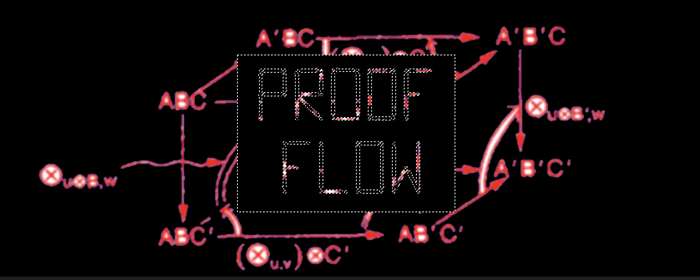

# ProofFlow

A GitHub App that brings structured RFC-based workflows to Lean 4 formalization projects — and optionally automates proof generation using AI.

Contributors propose theorems via GitHub issues. Maintainers review and approve them. Once approved, an AI agent (powered by [Aristotle](https://aristotle.harmonic.fun) or Claude) writes the Lean 4 proof, opens a draft PR, and waits for CI. When CI passes, the PR is promoted for human review and merged.

---

## How it works

### 1. RFC submission

Contributors open a GitHub issue with the `proofflow:rfc` label. The issue body must contain six sections:

```
## Statement
## Proof strategy
## Prior work
## Proposed decomposition
## Known obstacles
## Alternatives considered
```

ProofFlow validates these automatically and posts a check. Missing sections block approval.

### 2. Review and approval

Senior contributors (listed in `.proofflow.yml`) review the RFC and post an **LGTM** comment to approve. Once approved, the RFC is eligible for formalization.

### 3. Agent formalization

When a maintainer applies the `proofflow:start-agent` label:

- If `ARISTOTLE_API_KEY` is set: [Aristotle](https://aristotle.harmonic.fun) receives the RFC body and autonomously produces a complete Lean 4 proof.
- Otherwise: Claude (`claude-sonnet-4-6`) generates the proof.

The agent opens a draft PR with the Lean code. The PR includes an attribution docstring crediting the RFC author:

```lean
/-! Proof strategy credited to @author, RFC #N -/
```

### 4. CI and merge

Your repo's Lean CI runs on the draft PR. If it passes, the PR is promoted to ready for review. A maintainer verifies the theorem statement matches the RFC, then merges.

If CI fails, the agent retries (up to 3 times by default). If all attempts fail, the RFC returns to the open queue with a failure comment.

---

## Configuration

Add a `.proofflow.yml` file to your repo root:

```yaml
# GitHub logins of contributors who can approve RFCs with LGTM
senior_contributors:
  - your-github-username

# Days before an inactive RFC is marked abandoned (default: 14)
rfc_abandon_days: 14

# Whether RFCs can be claimed by the AI agent (default: false)
ai_claimable: true

# AI agent settings (optional)
ai_agent:
  enabled: true
  max_iterations: 3          # Retry attempts if CI fails (1–5, default: 3)
  target_directory: Proofs   # Where to write .lean files (optional)
```

If `.proofflow.yml` is absent, ProofFlow uses defaults but `senior_contributors` must be set for LGTM approval to work.

---

## Installation

### 1. Install the GitHub App

Click **[Install ProofFlow](https://github.com/apps/proof-flow)** and select the repositories you want to use it with.

That's it — no server setup required. ProofFlow runs as a hosted service.

### 2. Configure your repo

Add a `.proofflow.yml` file to your repo root:

```yaml
senior_contributors:
  - your-github-username
```

See the [Configuration](#configuration) section above for all available options.

### 3. Add the RFC issue template (optional but recommended)

See the [RFC template](#rfc-template) section below. This pre-fills the required sections when contributors open a new issue.

---

## Self-hosting

If you prefer to run your own instance, see [SELF_HOSTING.md](SELF_HOSTING.md).

---

## RFC template

You can add this as a GitHub issue template in `.github/ISSUE_TEMPLATE/rfc.md`:

```markdown
---
name: ProofFlow RFC
about: Propose a theorem for formalization
labels: proofflow:rfc
---

## Statement

<!-- State the theorem precisely. Include the Lean 4 type signature if possible. -->

## Proof strategy

<!-- Describe the proof approach at a high level. -->

## Prior work

<!-- Reference any existing Mathlib lemmas, papers, or prior formalizations. -->

## Proposed decomposition

<!-- Break the proof into steps. -->

## Known obstacles

<!-- Identify tricky parts: Nat division, universe issues, missing Mathlib lemmas, etc. -->

## Alternatives considered

<!-- Other proof approaches you considered and why you chose this one. -->
```

---

## Local development

```sh
cp .env.example .env
# Fill in APP_ID, PRIVATE_KEY, WEBHOOK_SECRET, DATABASE_URL, ANTHROPIC_API_KEY

npm install
npm run migrate
npm run dev
```

Use [smee.io](https://smee.io) to forward GitHub webhooks to localhost during development.

---

## License

MIT
